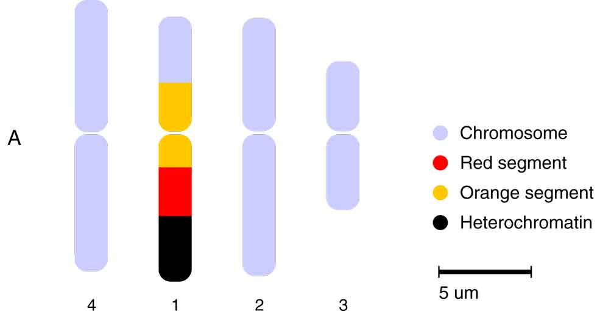
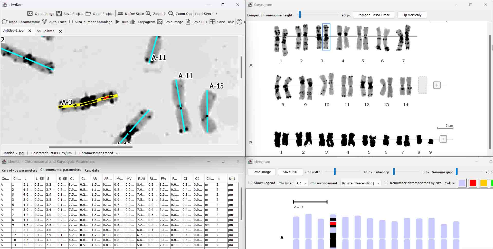

# IdeoKar2

A Java tool for extracting chromosomal/karyotypic
parameters from metaphase chromosome-spread images and building ideograms,
including multi-row ideograms for allopolyploids (one row per genome) or
 multi-row ideograms for multi-species.

## System Requirements

To run IdeoKar from the compiled JAR file, the following are required:

- Operating System: Windows, Linux, or macOS
- Java: Java Runtime Environment (JRE) or Java Development Kit (JDK)
- Recommended Java version: Java 17 or newer

## Run

Check Java Installation. Open Command Prompt (CMD) or a terminal and run:

```
java -version
```

If Java is installed, you should see the installed Java version, for example:

```
openjdk version "17.x.x"
```

## Run IdeoKar

Place IdeoKar2.jar file in a convenient folder. Open CMD and navigate to that folder:

```
cd C:\Path\To\IdeoKar
```

Then run:

```
java -jar IdeoKar2.jar
```


*Figure 1 – The main working windows of IdeoKar2. Chromosomes may be traced manually or generated using the auto-trace option. Automatically generated traces can subsequently be inspected and manually adjusted, for example by retracing individual chromosomes, repositioning centromeres, and correcting chromosome names or assignments.*


<figure>
    
  <figcaption aria-hidden="true">
    Figure 2: A sample ideogram output of IdeoKar2. The legend and chromosome labels can be edited by double-clicking them. The legend can also be moved, hidden, or removed according to the user's needs.
  </figcaption>
</figure>

<p><br></p>


<figure>
    
  <figcaption aria-hidden="true">
    Figure 3: Four-window layout of IdeoKar2 showing the integrated workflow for chromosome analysis. The Core window is used to open metaphase chromosome-spread images, define scale, trace chromosomes, and inspect or manually adjust chromosome traces. The Parameters window presents calculated karyotype-level, chromosomal, and raw tracing data. The Ideogram window displays the final chromosome ideogram with genome/sub-genome rows, chromosome labels, scale information, and an editable legend. The Karyogram window provides an organized view of the traced chromosomes for visual quality control and manual adjustment of chromosome organization. A chromosome selected in the Karyogram can be linked back to its corresponding source-image trace, which is highlighted in the Core window to facilitate direct inspection and correction. Together, these windows support a workflow from automatic or manual tracing, through inspection and adjustment, to calculation of chromosomal parameters and generation of the final ideogram.
  </figcaption>
</figure>

<p><br></p>


## IdeoKar Windows

IdeoKar provides four main working windows:

1. **Core window** — contains the main toolbar (`Open Image(s)`, `Close Tab`,
   `Define Scale`, `Zoom In`, `Zoom Out`, `Undo Chromosome`, `Run`,
   `Save Ideogram`, `Save Table`, and `Help`) and a tabbed area with one
   tab per opened image. This is the main workspace for image viewing,
   chromosome tracing, scale definition, and manual inspection of traces.

2. **Parameters window** — opens or refreshes when you click `Run`. It contains
   three tabs:
   - **Karyotype parameters** — per-genome or per-sub-genome aggregates.
   - **Chromosomal parameters** — per-chromosome results.
   - **Raw data** — traced coordinates and landmark data.

3. **Ideogram window** — opens or refreshes after `Run`. It displays one row
   per genome/sub-genome, with chromosomes sorted longest-first and aligned
   on a common centromere line, together with a scale bar. It has its own
   `Save Ideogram` button, which is also accessible from the Core window
   toolbar. The ideogram legend and labels can be edited or removed as
   described below.

4. **Karyogram window** — provides an organized visual view of the traced
   chromosomes and is particularly useful for quality control and manual
   inspection of chromosome assignments. Chromosomes can be reviewed as a
   group, and the Karyogram can be used to identify chromosomes that require
   further inspection or adjustment in their original source images. Clicking
   a chromosome in the Karyogram selects the corresponding chromosome trace
   in its source image and highlights it, making it easier to move directly
   from the karyotype-level view to detailed inspection of the original trace.

## Auto-Tracing and Manual Inspection/Adjustment

IdeoKar2 supports both **automatic chromosome tracing (auto-trace)** and
**manual chromosome tracing**. Auto-tracing can substantially speed up the
initial extraction of chromosome traces from suitable metaphase spread images,
while manual tracing remains available when a chromosome is not correctly
identified or when the image requires more careful interpretation.

Automatic tracing should be treated as an initial tracing step rather than as
a substitute for visual quality control. Depending on image quality, chromosome
overlap, background structure, staining intensity, and chromosome boundaries,
an automatically generated trace may require correction before the chromosome
is used for quantitative analysis.

A recommended workflow is:

1. **Open the metaphase image(s)** and define the appropriate scale.
2. **Run auto-trace** when appropriate to generate initial chromosome traces.
3. **Inspect the generated traces** in the Core window. Check that each trace
   follows the chromosome correctly and that the chromosome is not confused
   with background structures or neighboring chromosomes.
4. **Manually adjust individual chromosomes when necessary.** A chromosome can
   be retraced or corrected individually rather than repeating the complete
   tracing process.
5. **Check the centromere position** and reposition it when the automatically
   detected or manually marked landmark is not correct. Accurate centromere
   placement is particularly important because short-arm and long-arm
   measurements, arm ratio, centromeric index, and chromosome classification
   depend on the centromere position.
6. **Check chromosome names and assignments**, including chromosome number and
   genome/sub-genome labels. Correct labels are important for grouping
   chromosomes into the appropriate karyogram and ideogram rows and for
   calculating group-level karyotype parameters.
7. **Use the Karyogram window for whole-set inspection.** Review the chromosome
   collection as an organized set and identify chromosomes that appear to be
   incorrectly assigned, mislabeled, inconsistently oriented, or in need of
   further inspection.
8. **Select a chromosome in the Karyogram to inspect its original trace.**
   Clicking a chromosome in the Karyogram selects the corresponding chromosome
   in its source image and highlights its trace. This provides a direct link
   between the organized karyogram view and the original metaphase image,
   allowing the user to verify the trace and make manual corrections without
   having to search through the image tabs for the chromosome.
9. **Repeat inspection and correction** until the chromosome set is consistent
   and the traces, centromeres, labels, and group assignments are satisfactory.
10. **Run the analysis** only after the final inspection and adjustment. The
    resulting chromosome measurements, karyotype parameters, and ideogram are
    then based on the reviewed tracing data.

### Karyogram-Based Quality Control

The Karyogram window is especially useful after auto-tracing because it provides
a chromosome-level overview that complements inspection of individual
metaphase images. It helps the user review the chromosome set as a whole rather
than evaluating each trace in isolation.

The Karyogram can be used to:

- visually inspect the organization of traced chromosomes;
- identify chromosomes that may have been assigned to the wrong chromosome
  number or genome/sub-genome group;
- review chromosome labels and grouping before final analysis;
- select an individual chromosome and immediately locate its corresponding
  trace in the original source image;
- highlight the selected chromosome trace in the source image for detailed
  inspection;
- return to the original image and manually retrace or adjust the chromosome
  when necessary.

This source-image/Karyogram connection is particularly useful when many
chromosomes have been traced across several image tabs. Instead of manually
searching each source image for a chromosome identified during Karyogram
inspection, the user can select the chromosome in the Karyogram and use the
highlighted source trace as a direct visual reference.

### Recommended Auto-Trace Quality-Control Sequence

For datasets in which auto-trace is used, the recommended sequence is:

**Auto-trace → inspect individual traces → correct/retrace problematic
chromosomes → verify centromeres → verify chromosome names and
genome/sub-genome assignments → inspect the complete set in the Karyogram →
select and verify questionable chromosomes in their source images → make final
manual adjustments → Run → generate parameters and ideogram.**

The Karyogram is therefore not only a presentation window; it is an important
quality-control and manual inspection stage between initial chromosome tracing
and final quantitative analysis.

## Workflow

1. **Open Image(s)** — select one or more images (same magnification, same
   genotype/replicate set). Each opens in its own tab.
2. **Define Scale** — click the button, then click two points of known
   real-world distance in the active image. A popup asks for that distance
   in micrometers and derives pixels-per-micron for that tab.
3. **Trace chromosomes** — use auto-trace when appropriate or trace manually.
   For manual tracing, left-click to lay down connected segments along the
   chromosome. At landmark points, either right-click for a context menu or
   use the following hotkeys:
   - `Ctrl+C` — Centromere.
   - `Ctrl+R` — Red segment start/end (press once to start and again to close).
   - `Ctrl+O` — Orange segment start/end.
   - `Ctrl+G` — Green segment start/end.
   - `Ctrl+B` — Black segment (heterochromatin) start/end.
   - `Ctrl+F` — Finish chromosome (opens a naming dialog).
4. **Inspect and adjust traces** — review automatically generated or manually
   traced chromosomes in the Core window. Retrace individual chromosomes,
   reposition centromeres, and correct chromosome names or assignments when
   needed.
5. **Undo tracing** — use `Ctrl+Z` to undo a segment or use `Undo Chromosome`.
   The latter can undo the most recent tracing action while a chromosome is in
   progress, or remove the last finished chromosome when no chromosome is
   currently being traced.
6. **Select and delete a chromosome** — clicking a traced chromosome highlights
   it in yellow. Pressing `Delete` removes the selected chromosome.
7. **Inspect the chromosome set in the Karyogram** — use the Karyogram window
   to review chromosome organization and identify chromosomes requiring further
   inspection. Clicking a chromosome in the Karyogram selects and highlights
   the corresponding trace in its source image, providing a direct connection
   between the Karyogram and the original metaphase image.
8. **Repeat and finalize chromosome assignments** — trace and inspect all
   chromosomes across all open tabs. Use consistent genome/sub-genome labels
   to group chromosomes into the same ideogram row and karyotype-parameter
   group; this is also how allopolyploid genomes are separated.
9. **Run** — computes parameters and (re)builds the ideogram.
10. **Save Table / Save Ideogram** — export results.
11. **Zoom** — hold `Ctrl` and scroll the mouse wheel over the active image to
    zoom in or out. Zooming is centered on the exact location under the mouse
    pointer, allowing detailed inspection of a specific chromosome or image
    region.

## Computed parameters

Per chromosome: short arm (S), long arm (L), total length (TCL = S+L), arm
ratio (L/S), centromeric index (S/TCL×100), relative length (chromosome's
share of its genome's total complement length), Levan-type classification
(m/sm/st/a/t), heterochromatin length and %, and 45S/5S rDNA site counts.

Per genome/sub-genome: chromosome count, total complement length, mean
chromosome length, summed arm lengths, mean arm ratio, mean centromeric
index, CVCL and CVCI (coefficients of variation of length and centromeric
index — inter-/intra-chromosomal asymmetry measures), the Romero-Zarco
(1986) A1/A2 asymmetry indices, and a karyotype formula (e.g. `6m + 2sm`).


## Save Project 

Save Project saves the complete project into the first image folder 
selected/used by the user. The project file stores the necessary 
relative image paths, so the project remains portable with its image folder.
Open Project can reopen the project later and restore the previous 
activities/settings. Existing tracing data, chromosome information, labels, 
colored segments, scaling, and other project settings will be preserved.


## Excel output

The Excel workbook contains:
1. Chromosomal parameters — homologous-group means and SE values.
2. Raw data — original traced pixel coordinates and landmarks.
3. Karyotype parameters — karyotype-level indices and Stebbins class.


## Chromosome banding

When one colored and one or more uncolored chromosomes with the same 
chromosome number are traced, the mean chromosome arm sizes are calculated 
from all traced homologs, while colored segments are mapped onto the mean chromosome 
rather than using the original traced chromosome's absolute arm length. 
Segment positions are scaled independently for the short and long arms so that
if the colored chromosome's short arm is shorter than the mean, the colored 
segment is expanded proportionally. If it is longer, the segment is proportionally 
shrunk. This enables simultaneous karyotyping and banding image preparation.

## Movable and Editable Legend

IdeoKar includes a customizable legend for chromosome ideograms. The legend automatically displays only the colors currently used for chromosome features and can be shown or hidden using the Show Legend controller. Users can drag the legend to reposition it on the image and edit individual legend descriptions. The legend can also be selected and deleted using the Delete key, and restored at any time by enabling Show Legend. The legend is included in exported image and PDF outputs.


## Abbreviations

| Parameter | Formula / Definition | Reference |
|-----------|----------------------|-----------|
| L | Mean length of long arm | |
| S | Mean length of short arm | |
| CL | Chromosome length = L + S | |
| AR | Arm Ratio = L/S | |
| r-value | S/L | |
| RL% | Relative length of chromosome = (CL / Sum(CL)) * 100 | |
| CI | Centromeric index = S / CL | |
| Chromosome type | Defined Terms in Table 2 of the KaryoMeasure manual | Levan et al., 1964 |
| F% | Form percentage of chromosome = (S / Sum(CL)) * 100 | |
| x | mean | |
| n | haploid chromosome number of an individual or a taxon | |
| s | standard deviation | |
| SE | standard error | |
| HCL | Total chromosome length of the haploid complement = Sum(CL) | |
| TF% | Total form percentage = (Sum(S) / Sum(CL)) * 100 | Huziwara, 1962 |
| Stebbins | Stebbins asymmetry index A–C, 1-4 (Table 3 of KaryoMeasure manual) | Stebbins, 1971 |
| AsK% | Arano index of karyotype asymmetry = (Sum(L) / Sum(CL)) * 100 | Arano, 1963 |
| A1 | Intrachromosomal asymmetry index = 1 - [Sum(Si / Li) / n] | Romero-Zarco, 1986 |
| A2 | Interchromosomal asymmetry index = sCL / xCL | Romero-Zarco, 1986 |
| S% | Symmetry index = (CL<sub>min</sub> / CL<sub>max</sub>) * 100 | |
| Xci | Mean centromeric index = Sum(CI) / n | |
| A | Degree of karyotype asymmetry = Sum((Li - Si) / (Li + Si)) / n | Watanabe et al., 1999 |
| Xca | Mean Centromeric Asymmetry = A * 100 | |
| CVcl | Coefficient of variation of chromosome length = (sCL / xCL) * 100 = A2 * 100 | Paszko, 2006 |
| Cvci | Coefficient of variation of centromeric index = (sCI / xCI) * 100 | Paszko, 2006 |
| AI | Asymmetry Index = (CVCL * CVCI) / 100 | Paszko, 2006 |


## Citing IdeoKar

If you use IdeoKar in a publication, please cite:

Mirzaghaderi, G. & Marzangi, K. (2015). IdeoKar: an ideogram constructing and karyotype analyzing software. Caryologia, 68(1), 31-35. https://doi.org/10.1080/00087114.2014.998526

Contact email: gh.mirzaghaderi@uok.ac.ir