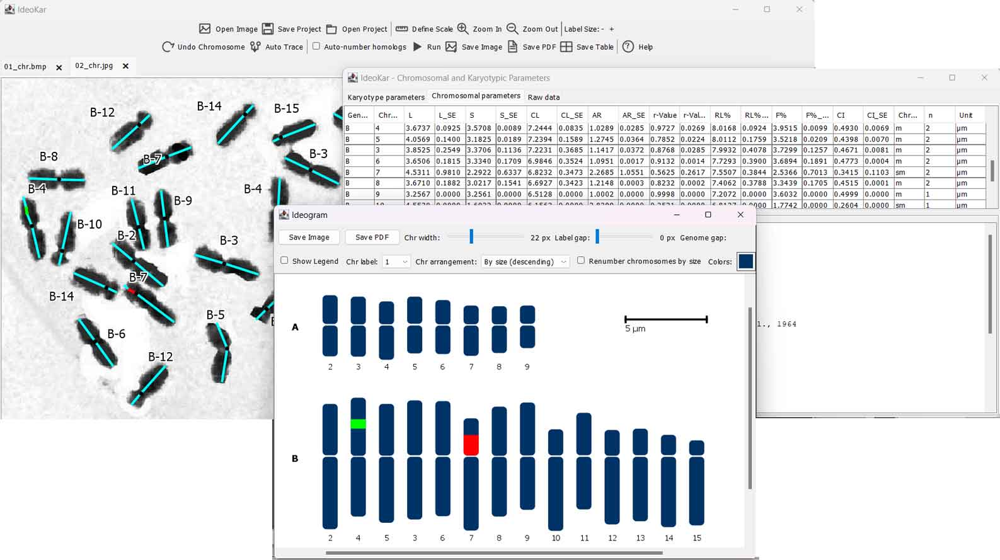

# IdeoKar2

A Java tool for extracting chromosomal/karyotypic
parameters from metaphase chromosome-spread images and building ideograms,
including multi-row ideograms for allopolyploids (one row per genome) or
 multi-row ideograms for multi-species.

## System Requirements

To run IdeoKar from the compiled JAR file, the following are required:

- Operating System: Windows, Linux, or macOS
- Java: Java Runtime Environment (JRE) or Java Development Kit (JDK)
- Recommended Java version: Java 17 or newer

## Run

Check Java Installation. Open Command Prompt (CMD) or a terminal and run:

```
java -version
```

If Java is installed, you should see the installed Java version, for example:

```
openjdk version "17.x.x"
```

## Run IdeoKar

Place IdeoKar2.jar file in a convenient folder. Open CMD and navigate to that folder:

```
cd C:\Path\To\IdeoKar
```

Then run:

```
java -jar IdeoKar2.jar
```




*Figure 1 – The three windows of IdeoKar2.*


## IdeoKar include three windows

1. Core window — toolbar (Open Image(s), Close Tab, Define Scale, Zoom In,
   Zoom Out, Undo Chromosome, Run, Save Ideogram, Save Table, Help) plus a
   tabbed area, one tab per opened image.
2. Parameters window — opens/refreshes when you click Run. Three
   tabs: Karyotype parameters (per-genome aggregates), Chromosomal
   parameters (per-chromosome table), and Raw data (traced coordinates).
3. Ideogram window — opens/refreshes on Run; one row per genome/
   sub-genome, chromosomes sorted longest-first and aligned on a common
   centromere line, with a scale bar. Has its own Save Ideogram button
   (also reachable from the core window's toolbar).

## Workflow

1. Open Image(s) — select one or more images (same magnification, same
   genotype/replicate set). Each opens in its own tab.
2. Define Scale — click the button, then click two points of known
   real-world distance in the active image; a popup asks for that distance
   in micrometers and derives pixels-per-micron for that tab.
3. Trace a chromosome — left-click to lay down connected segments along
   the chromosome. At landmark points, either right-click for a context
   menu or use hotkeys:
    Ctrl+C  Centromere
    Ctrl+R  Red segment start/end (press once to start, again to close the segment)
    Ctrl+O  Orange segment start/end
    Ctrl+G  Green segment start/end
    Ctrl+B  Black segment (heterochromatin) start/end
    Ctrl+F  Finish chromosome (opens a naming dialog)

4. Undo segment (Ctrl+Z) or undo Chromosome (Click on the undo Chromosome icon to 
   undo the last click while tracing, or removes the last finished chromosome if 
   nothing is in progress.
5. Clicking on a traced chromosome highlights/selects it. The selected chromosome 
   is highlighted in yellow, and pressing Delete, removes the selected chromosome.
6. Repeat for all chromosomes across all open tabs (mark the same
   genome/sub-genome label to group chromosomes into the same ideogram row
   and karyotype-parameter group — this is how allopolyploid genomes are
   separated).
7. Run — computes parameters and (re)builds the ideogram.
8. Save Table / Save Ideogram — export results.
9. Hold Ctrl and scroll the mouse wheel over the active image to Zoom in and 
   Zoom out. Zooming is centered on the exact location under the mouse pointer, 
   so you can zoom into a specific chromosome or image region.

## Computed parameters

Per chromosome: short arm (S), long arm (L), total length (TCL = S+L), arm
ratio (L/S), centromeric index (S/TCL×100), relative length (chromosome's
share of its genome's total complement length), Levan-type classification
(m/sm/st/a/t), heterochromatin length and %, and 45S/5S rDNA site counts.

Per genome/sub-genome: chromosome count, total complement length, mean
chromosome length, summed arm lengths, mean arm ratio, mean centromeric
index, CVCL and CVCI (coefficients of variation of length and centromeric
index — inter-/intra-chromosomal asymmetry measures), the Romero-Zarco
(1986) A1/A2 asymmetry indices, and a karyotype formula (e.g. `6m + 2sm`).


## Save Project 

Save Project saves the complete project into the first image folder 
selected/used by the user. The project file stores the necessary 
relative image paths, so the project remains portable with its image folder.
Open Project can reopen the project later and restore the previous 
activities/settings. Existing tracing data, chromosome information, labels, 
colored segments, scaling, and other project settings will be preserved.


## Excel output

The Excel workbook contains:
1. Chromosomal parameters — homologous-group means and SE values.
2. Raw data — original traced pixel coordinates and landmarks.
3. Karyotype parameters — karyotype-level indices and Stebbins class.


## Chromosome banding

When one colored and one or more uncolored chromosomes with the same 
chromosome number are traced, the mean chromosome arm sizes are calculated 
from all traced homologs, while colored segments are mapped onto the mean chromosome 
rather than using the original traced chromosome's absolute arm length. 
Segment positions are scaled independently for the short and long arms so that
if the colored chromosome's short arm is shorter than the mean, the colored 
segment is expanded proportionally. If it is longer, the segment is proportionally 
shrunk. This enable used simultaneous karyotyping and banding image preparation.

## Movable and Editable Legend

IdeoKar includes a customizable legend for chromosome ideograms. The legend automatically displays only the colors currently used for chromosome features and can be shown or hidden using the Show Legend controller. Users can drag the legend to reposition it on the image and edit individual legend descriptions. The legend can also be selected and deleted using the Delete key, and restored at any time by enabling Show Legend. The legend is included in exported image and PDF outputs.


## Abbreviations

| Parameter | Formula / Definition | Reference |
|-----------|----------------------|-----------|
| L | Mean length of long arm | |
| S | Mean length of short arm | |
| CL | Chromosome length = L + S | |
| AR | Arm Ratio = L/S | |
| r-value | S/L | |
| RL% | Relative length of chromosome = (CL / Sum(CL)) * 100 | |
| CI | Centromeric index = S / CL | |
| Chromosome type | Defined Terms in Table 2 of the KaryoMeasure manual | Levan et al., 1964 |
| F% | Form percentage of chromosome = (S / Sum(CL)) * 100 | |
| x | mean | |
| n | haploid chromosome number of an individual or a taxon | |
| s | standard deviation | |
| SE | standard error | |
| HCL | Total chromosome length of the haploid complement = Sum(CL) | |
| TF% | Total form percentage = (Sum(S) / Sum(CL)) * 100 | Huziwara, 1962 |
| Stebbins | Stebbins asymmetry index A–C, 1-4 (Table 3 of KaryoMeasure manual) | Stebbins, 1971 |
| AsK% | Arano index of karyotype asymmetry = (Sum(L) / Sum(CL)) * 100 | Arano, 1963 |
| A1 | Intrachromosomal asymmetry index = 1 - [Sum(Si / Li) / n] | Romero-Zarco, 1986 |
| A2 | Interchromosomal asymmetry index = sCL / xCL | Romero-Zarco, 1986 |
| S% | Symmetry index = (CL<sub>min</sub> / CL<sub>max</sub>) * 100 | |
| Xci | Mean centromeric index = Sum(CI) / n | |
| A | Degree of karyotype asymmetry = Sum((Li - Si) / (Li + Si)) / n | Watanabe et al., 1999 |
| Xca | Mean Centromeric Asymmetry = A * 100 | |
| CVcl | Coefficient of variation of chromosome length = (sCL / xCL) * 100 = A2 * 100 | Paszko, 2006 |
| Cvci | Coefficient of variation of centromeric index = (sCI / xCI) * 100 | Paszko, 2006 |
| AI | Asymmetry Index = (CVCL * CVCI) / 100 | Paszko, 2006 |


Contact email: gh.mirzaghaderi@uok.ac.ir